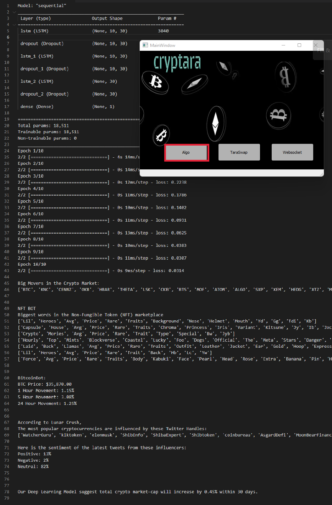

---
---

># *Desktop application*
>### *  Market analysis algorithm  
>### *  Gateway to token-swapping on the Ethereum network with our customized platform, TaraSwap.

#

1) Market Analysis Algorithm

- Conducts Technical Analysis with oscillators and momentum indicators from TradingView
- Leverages Twitter API to run Natural Language Processing to determine current market sentiment


2) Cryptara Web3 Front End: [TaraSwap](https://ast-xxi.github.io/Cryptara_FinalProject/)💱

- Web3 application that allows users to swap tokens in-app
- Utilizes Moralis 1inch plugin which integrates DEX aggregator 1inch
- Works with Ethereum blockchain

---

## Overview

- Provide key insight into the cryptocurrency market
- Predict market-cap movement within 30 days using LSTM
- Provide gateway to Ethereum network via customized TaraSwap
---

## Required Installations & Environment setup 

- Be sure to make the proper installations before running the Cryptara App
- You can find a link to sign up for TradingView & Twitter Developer accounts below.
- We highly encourge users to clone the Cryptara environment file via cryptara.yml
```bash
conda env create --file cryptara.yml
```
___

## Running PyQt Application

- Git bash or run in command line prompt

```bash
python main.py
```


=======


## Interacting with Application Buttons

- Run Algorithm:

  - Run Technical Analysis with oscillators and momentum indicators from TradingView

  - Natural Language Processing leveraging Twitter Bots

- TaraSwap:

  - Launch browser to the TaraSwap application

  - Sign into Metamask and start trading on the Blockchain!

- Run Websocket:

  - Get real-time data by connecting the websocket functionality

  - This feature requires an active TradingView & Twitter Developer account
___
### Taraswap


---
### LSTM


---

 

> ## PyQt? 
>
> PyQt is widely used for create GUI-based programs. Learn More about PyQt [here](https://riverbankcomputing.com/software/pyqt/intro).
>
---


>## What is TradingView?
> [TradingView](https://www.tradingview.com/) is a charting platform and a social network with over 30 million + users. TradingView provides latest (real time) stock, futures, index, Forex and cryptocurrencies data.
>

___


> [LunarCrush Developer Account](https://legacy.lunarcrush.com/developers/pricing)
>## What is LunarCrush?
>LunarCrush is a social metric tool that gathers social data across multiple social platforms including Youtube, Twitter, Reddit, and News Articles. It gathers social trends and applies sentiment tools to price and market data for thousands of coins in the crypto market. Get top influencers for coins in your portfolio or use it as a tool to predict future trends in the crypto market. Grab a free LunarCrush developer account basic plan, or choose from one of their higher tiered plans.

---


> [Twitter Developer Account](https://developer.twitter.com/en)
>## What is Twitter?
>Twitter is one of the largest social networking sites, where users can communicate using "tweets". Trending hashtags and topics keep users up to date with the latest conversations. [#bitcoin](https://twitter.com/search?q=%23bitcoin) [$ETH](https://twitter.com/i/topics/1007361429752594432)
____

## Future Project Development

- Web3 portfolio tracker
- Transactions placed on Cryptara’s own PoS network
- Award users with native coins to incentivize using the network for transactions
- Using Cryptara as a tool for analysis/monitoring blockchain data
- Making a DAO (decentralized autonomous organization) - blockchain-based organization used for governance of Ethereum dApps, propose and decide on changes
- Have cryptara’s algo trade with the money in the DAO treasury, and give holders the ability to vote on changes in the code of the algo
- Use smart contracts to execute arbitrage opportunity trades that only execute when profitable, using flash loan transactions (which depend on smart contracts for receiving, using, and paying back the loan in the same transaction)


Cryptara Developers: Alexis Santoyo Torres, Andrew Brown, Aaron Price, Jake Teele, Odette Popko
