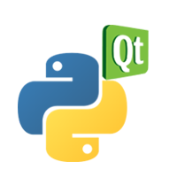

># A desktop application:
>### ~  Market analysis algorithm  
>### ~ Gateway to token-swapping transactions using the Ethereum network with the Cryptara platform (TaraSwap)

#

1) Covalent/Blockchain Data API

- Access organized multichain blockchain data
- Gather historical data from all main chains
- Access to Defi & NFT & on-chain metrics
- Run data analysis through ML portion

2) Cryptara Web3 Front End: [TaraSwap](https://ast-xxi.github.io/Cryptara_FinalProject/)💱

- A plugin that allows users to swap tokens in-app
- Moralis 1inch plugin integrates Defi/DEX aggregator 1inch
- Works with Ethereum, Binance Smart Chain & Polygon blockchains

---

## Overview

- Provide key insight into the cryptocurrency market
- Predict market movement
- Provide gateway to ethereum network via customized TaraSwap
- Identify arbitrage opportunities in the market while utilizing bullish/bearish market momentum
---

## Required Installations & Environment setup 

- Be sure to make the proper installations before running the Cryptara App
- We highly encourge users to clone the Cryptara environment file via cryptara.yml
```bash
conda env create --file cryptara.yml
```
___

## Running PyQt Application

- Git bash or run in command line prompt

```bash
python main.py  
```

<<<<<<< HEAD

=======

>>>>>>> 793f13306772d61fdcf3d224ccc00430d56dd78b

## Interacting with Application Buttons

- Run Algorithm:

  - Run Technical Analysis with oscillators and momentum indicators from TradingView

  - Natural Language Processing leveraging Twitter Bots

- TaraSwap:

  - Launch browser to the TaraSwap application

  - Sign into Metamask and start trading on the Blockchain!

- Run Websocket:

  - Get real-time data by connecting the websocket functionality

  - This feature requires an active TradingView & Twitter Developer account
___


___

 

> ## PyQt? 
>
> PyQt is widely used for create GUI-based programs. Learn More about PyQt [here](https://riverbankcomputing.com/software/pyqt/intro).

----


>## What is TradingView?
> [TradingView](https://www.tradingview.com/) is a charting platform and a social network with over 30 million + users. TradingView provides latest (real time) stock, futures, index, Forex and cryptocurrencies data.
>

___


>## What is Twitter?
>Twitter is one of the largest social networking sites, where users can communicate using "tweets". Trending hashtags and topics keep users up to date with the latest conversations. [#bitcoin](https://twitter.com/search?q=%23bitcoin) [$ETH](https://twitter.com/i/topics/1007361429752594432)
____

## Future Project Development

- Web3 portfolio tracker
- Building Cryptara into a one-stop-shop DEX
- Transactions placed on Cryptara’s own PoS network
- Award users with native coins to incentivize using the network for transactions
- Using Cryptara as a tool for analysis/monitoring blockchain data
- Making a DAO (decentralized autonomous organization) - blockchain-based organization used for governance of Ethereum dApps, propose and decide on changes
- Have cryptara’s algo trade with the money in the DAO treasury, and give holders the ability to vote on changes in the code of the algo
- Use smart contracts to execute arbitrage opportunity trades that only execute when profitable, using flash loan transactions (which depend on smart contracts for receiving, using, and paying back the loan in the same transaction)


Cryptara Developers: Alexis Santoyo Torres, Andrew Brown, Aaron Price, Jake Teele, Odette Popko
